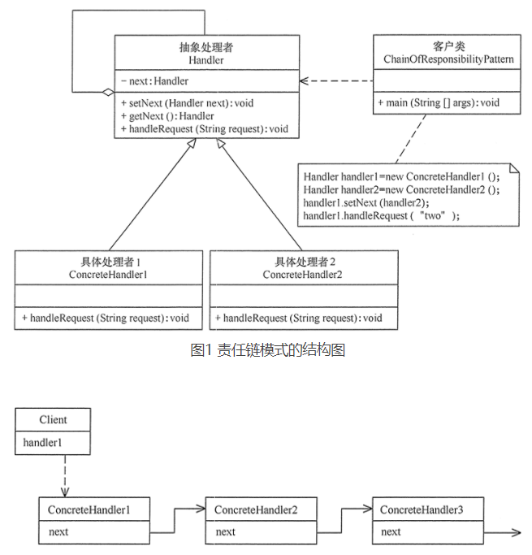

#责任链模式
##定义：
为了避免请求发送者与多个请求处理者耦合在一起，于是将所有请求的处理者通过前一对象记住其下一个对象的引用而连成一条链；当有请求发生时，可将请求沿着这条链传递，直到有对象处理它为止。
##场景：
+ 1、多个对象可以处理一个请求，但具体由哪个对象处理该请求在运行时自动确定。
+ 2、可动态指定一组对象处理请求，或添加新的处理者。
+ 3、需要在不明确指定请求处理者的情况下，向多个处理者中的一个提交请求。
##扩展：
+ 1、纯的职责链模式：一个请求必须被某一个处理者对象所接收，且一个具体处理者对某个请求的处理只能采用以下两种行为之一：自己处理（承担责任）；把责任推给下家处理。
+ 2、不纯的职责链模式：允许出现某一个具体处理者对象在承担了请求的一部分责任后又将剩余的责任传给下家的情况，且一个请求可以最终不被任何接收端对象所接收。
##结构
+ 抽象处理者（Handler）角色：定义一个处理请求的接口，包含抽象处理方法和一个后继连接。
+ 具体处理者（Concrete Handler）角色：实现抽象处理者的处理方法，判断能否处理本次请求，如果可以处理请求则处理，否则将该请求转给它的后继者。
+ 客户类（Client）角色：创建处理链，并向链头的具体处理者对象提交请求，它不关心处理细节和请求的传递过程。
