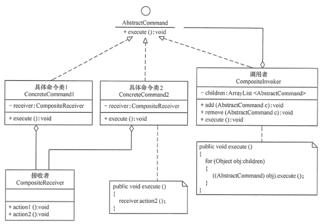
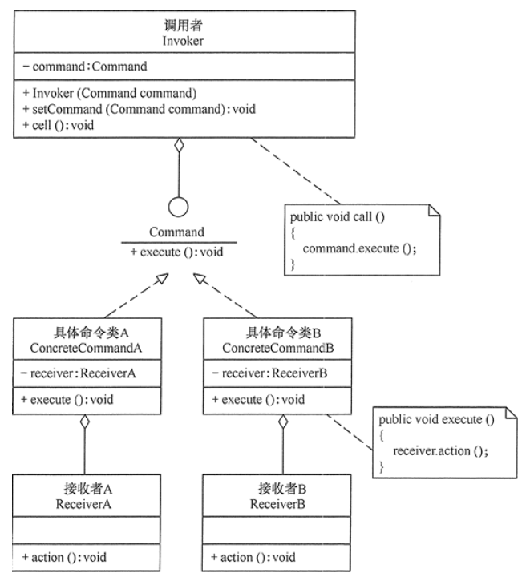

#命令模式
##定义：
将一个请求封装为一个对象，使发出请求的责任和执行请求的责任分割开。这样两者之间通过命令对象进行沟通，这样方便将命令对象进行储存、传递、调用、增加与管理。
##场景：
+ 1、请求调用者需要与请求接收者解耦时，命令模式可以使调用者和接收者不直接交互。
+ 2、系统随机请求命令或经常增加、删除命令时，命令模式可以方便地实现这些功能。
+ 3、当系统需要执行一组操作时，命令模式可以定义宏命令来实现该功能。
+ 4、当系统需要支持命令的撤销（Undo）操作和恢复（Redo）操作时，可以将命令对象存储起来，采用备忘录模式来实现。
##扩展：
在软件开发中，有时将命令模式与前面学的组合模式联合使用，这就构成了宏命令模式，也叫组合命令模式。宏命令包含了一组命令，它充当了具体命令与调用者的双重角色，执行它时将递归调用它所包含的所有命令

##结构
+ 抽象命令类（Command）角色：声明执行命令的接口，拥有执行命令的抽象方法 execute()。
+ 具体命令类（Concrete Command）角色：是抽象命令类的具体实现类，它拥有接收者对象，并通过调用接收者的功能来完成命令要执行的操作。
+ 实现者/接收者（Receiver）角色：执行命令功能的相关操作，是具体命令对象业务的真正实现者。
+ 调用者/请求者（Invoker）角色：是请求的发送者，它通常拥有很多的命令对象，并通过访问命令对象来执行相关请求，它不直接访问接收者。
