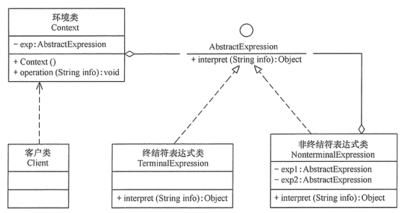

#解释器模式
##定义：
给分析对象定义一个语言，并定义该语言的文法表示，再设计一个解析器来解释语言中的句子。也就是说，用编译语言的方式来分析应用中的实例。  
这种模式实现了文法表达式处理的接口，该接口解释一个特定的上下文。
##场景：
+ 1、当语言的文法较为简单，且执行效率不是关键问题时。
+ 2、当问题重复出现，且可以用一种简单的语言来进行表达时。
+ 3、当一个语言需要解释执行，并且语言中的句子可以表示为一个抽象语法树的时候，如 XML 文档解释。
##结构
+ 抽象表达式（Abstract Expression）角色：定义解释器的接口，约定解释器的解释操作，主要包含解释方法 interpret()。
+ 终结符表达式（Terminal Expression）角色：是抽象表达式的子类，用来实现文法中与终结符相关的操作，文法中的每一个终结符都有一个具体终结表达式与之相对应。
+ 非终结符表达式（Nonterminal Expression）角色：也是抽象表达式的子类，用来实现文法中与非终结符相关的操作，文法中的每条规则都对应于一个非终结符表达式。
+ 环境（Context）角色：通常包含各个解释器需要的数据或是公共的功能，一般用来传递被所有解释器共享的数据，后面的解释器可以从这里获取这些值。
+ 客户端（Client）：主要任务是将需要分析的句子或表达式转换成使用解释器对象描述的抽象语法树，然后调用解释器的解释方法，当然也可以通过环境角色间接访问解释器的解释方法。
