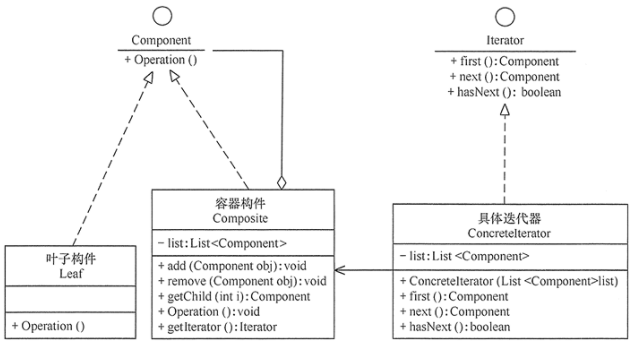
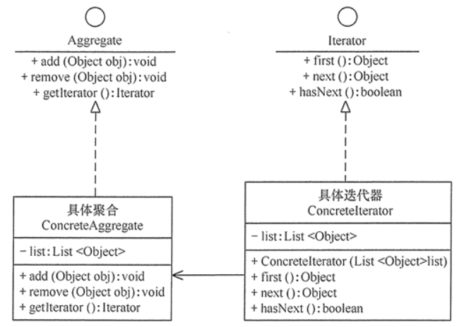

#迭代器模式
##定义：
提供一个对象来顺序访问聚合对象中的一系列数据，而不暴露聚合对象的内部表示
##场景：
+ 1、当需要为聚合对象提供多种遍历方式时。
+ 2、当需要为遍历不同的聚合结构提供一个统一的接口时。
+ 3、当访问一个聚合对象的内容而无须暴露其内部细节的表示时。
##扩展：
迭代器模式常常与组合模式结合起来使用，在对组合模式中的容器构件进行访问时，经常将迭代器潜藏在组合模式的容器构成类中。当然，也可以构造一个外部迭代器来对容器构件进行访问

##结构
+ 抽象聚合（Aggregate）角色：定义存储、添加、删除聚合对象以及创建迭代器对象的接口。
+ 具体聚合（ConcreteAggregate）角色：实现抽象聚合类，返回一个具体迭代器的实例。
+ 抽象迭代器（Iterator）角色：定义访问和遍历聚合元素的接口，通常包含 hasNext()、first()、next() 等方法。
+ 具体迭代器（ConcreteIterator）角色：实现抽象迭代器接口中所定义的方法，完成对聚合对象的遍历，记录遍历的当前位置。
