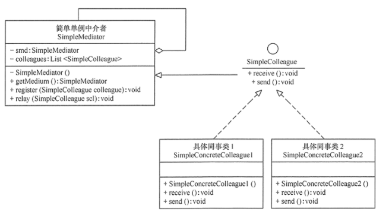
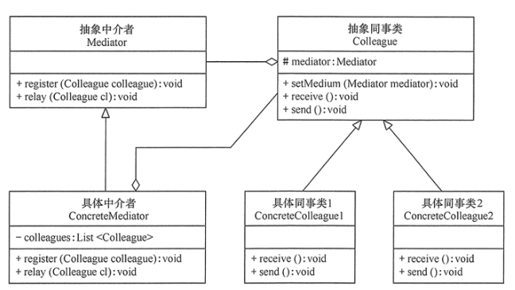

#中介者模式
##定义：
指多个对象间存在一对多的依赖关系，当一个对象的状态发生改变时，所有依赖于它的对象都得到通知并被自动更新。这种模式有时又称作发布-订阅模式、模型-视图模式，它是对象行为型模式。
##场景：
+ 1、当对象之间存在复杂的网状结构关系而导致依赖关系混乱且难以复用时。
+ 2、当想创建一个运行于多个类之间的对象，又不想生成新的子类时。
##扩展：
+ 1、不定义中介者接口，把具体中介者对象实现成为单例。
+ 2、同事对象不持有中介者，而是在需要的时候直接获取中介者对象并调用。

##结构
+ 抽象中介者（Mediator）角色：它是中介者的接口，提供了同事对象注册与转发同事对象信息的抽象方法。
+ 具体中介者（Concrete Mediator）角色：实现中介者接口，定义一个 List 来管理同事对象，协调各个同事角色之间的交互关系，因此它依赖于同事角色。
+ 抽象同事类（Colleague）角色：定义同事类的接口，保存中介者对象，提供同事对象交互的抽象方法，实现所有相互影响的同事类的公共功能。
+ 具体同事类（Concrete Colleague）角色：是抽象同事类的实现者，当需要与其他同事对象交互时，由中介者对象负责后续的交互。
