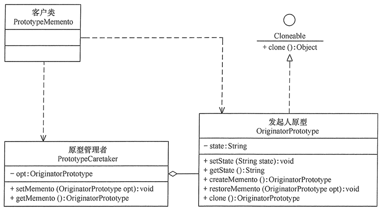
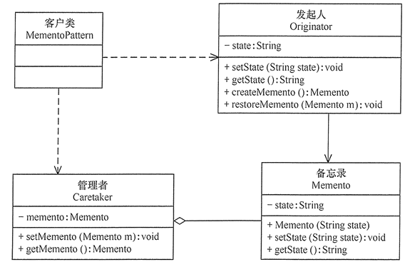

#备忘录模式
##定义：
在不破坏封装性的前提下，捕获一个对象的内部状态，并在该对象之外保存这个状态，以便以后当需要时能将该对象恢复到原先保存的状态。该模式又叫快照模式。
##场景：
+ 1、需要保存与恢复数据的场景，如玩游戏时的中间结果的存档功能。
+ 2、需要提供一个可回滚操作的场景，如 Word、记事本、Photoshop，Eclipse 等软件在编辑时按 Ctrl+Z 组合键，还有数据库中事务操作。
##扩展：
在前面介绍的备忘录模式中，有单状态备份的例子，也有多状态备份的例子。  
下面介绍备忘录模式如何同原型模式混合使用。在备忘录模式中，通过定义“备忘录”来备份“发起人”的信息，而原型模式的 clone() 方法具有自备份功能，所以，如果让发起人实现 Cloneable 接口就有备份自己的功能，这时可以删除备忘录类

##结构
+ 发起人（Originator）角色：记录当前时刻的内部状态信息，提供创建备忘录和恢复备忘录数据的功能，实现其他业务功能，它可以访问备忘录里的所有信息。
+ 备忘录（Memento）角色：负责存储发起人的内部状态，在需要的时候提供这些内部状态给发起人。
+ 管理者（Caretaker）角色：对备忘录进行管理，提供保存与获取备忘录的功能，但其不能对备忘录的内容进行访问与修改。
