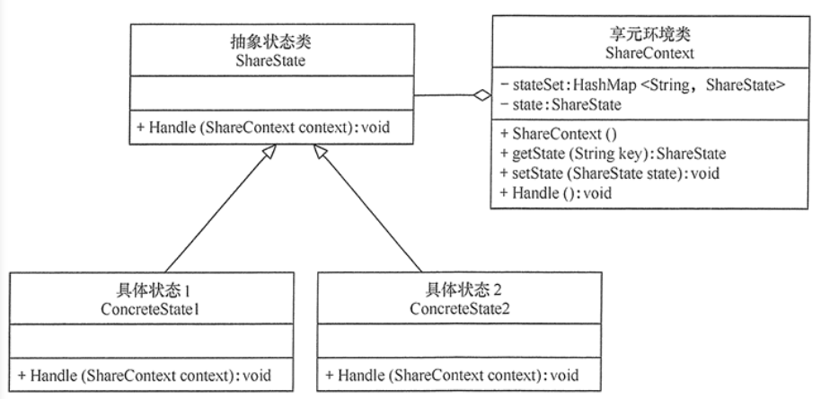
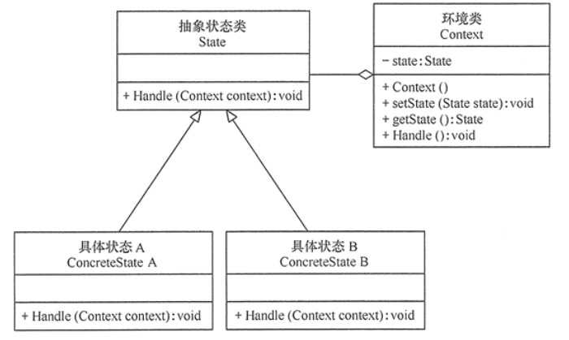

#状态模式
##定义：
对有状态的对象，把复杂的“判断逻辑”提取到不同的状态对象中，允许状态对象在其内部状态发生改变时改变其行为。
##场景：
+ 1、当一个对象的行为取决于它的状态，并且它必须在运行时根据状态改变它的行为时，就可以考虑使用状态模式。
+ 2、一个操作中含有庞大的分支结构，并且这些分支决定于对象的状态时。
##扩展：
在有些情况下，可能有多个环境对象需要共享一组状态，这时需要引入享元模式，将这些具体状态对象放在集合中供程序共享

##结构
+ 抽象状态（State）角色：定义一个接口，用以封装环境对象中的特定状态所对应的行为，可以有一个或多个行为。
+ 具体状态（Concrete State）角色：实现抽象状态所对应的行为，并且在需要的情况下进行状态切换。
+ 环境类（Context）角色：也称为上下文，它定义了客户端需要的接口，内部维护一个当前状态，并负责具体状态的切换。
