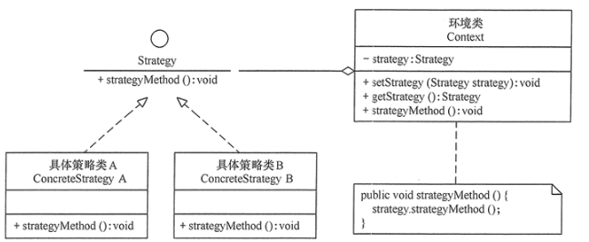

#模板方法模式
##定义：
该模式定义了一系列算法，并将每个算法封装起来，使它们可以相互替换，且算法的变化不会影响使用算法的客户。  
策略模式属于对象行为模式，它通过对算法进行封装，把使用算法的责任和算法的实现分割开来，并委派给不同的对象对这些算法进行管理。
##场景：
+ 1、一个系统需要动态地在几种算法中选择一种时，可将每个算法封装到策略类中。
+ 2、一个类定义了多种行为，并且这些行为在这个类的操作中以多个条件语句的形式出现，可将每个条件分支移入它们各自的策略类中以代替这些条件语句。
+ 3、系统中各算法彼此完全独立，且要求对客户隐藏具体算法的实现细节时。
+ 4、系统要求使用算法的客户不应该知道其操作的数据时，可使用策略模式来隐藏与算法相关的数据结构。
+ 5、多个类只区别在表现行为不同，可以使用策略模式，在运行时动态选择具体要执行的行为。
##扩展：
在一个使用策略模式的系统中，当存在的策略很多时，客户端管理所有策略算法将变得很复杂，如果在环境类中使用策略工厂模式来管理这些策略类将大大减少客户端的工作复杂度

##结构
+ 抽象策略（Strategy）类：定义了一个公共接口，各种不同的算法以不同的方式实现这个接口，环境角色使用这个接口调用不同的算法，一般使用接口或抽象类实现。
+ 具体策略（Concrete Strategy）类：实现了抽象策略定义的接口，提供具体的算法实现。
+ 环境（Context）类：持有一个策略类的引用，最终给客户端调用。
