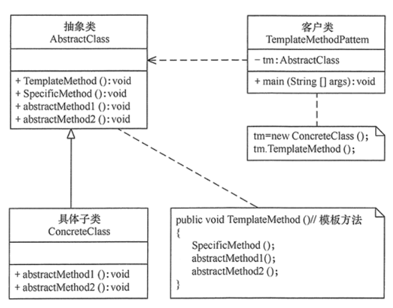

#模板方法模式
##定义：
定义一个操作中的算法骨架，而将算法的一些步骤延迟到子类中，使得子类可以不改变该算法结构的情况下重定义该算法的某些特定步骤
##场景：
+ 1、算法的整体步骤很固定，但其中个别部分易变时，这时候可以使用模板方法模式，将容易变的部分抽象出来，供子类实现。
+ 2、当多个子类存在公共的行为时，可以将其提取出来并集中到一个公共父类中以避免代码重复。首先，要识别现有代码中的不同之处，并且将不同之处分离为新的操作。最后，用一个调用这些新的操作的模板方法来替换这些不同的代码。
+ 3、当需要控制子类的扩展时，模板方法只在特定点调用钩子操作，这样就只允许在这些点进行扩展。
##结构
+ 1、抽象类（Abstract Class）：负责给出一个算法的轮廓和骨架。它由一个模板方法和若干个基本方法构成。这些方法的定义如下。
+ 1.1、模板方法：定义了算法的骨架，按某种顺序调用其包含的基本方法。
+ 1.2、 基本方法：是整个算法中的一个步骤，包含以下几种类型。
+ 1.2.1、抽象方法：在抽象类中申明，由具体子类实现。
+ 1.2.2、具体方法：在抽象类中已经实现，在具体子类中可以继承或重写它。
+ 1.2.3、钩子方法：在抽象类中已经实现，包括用于判断的逻辑方法和需要子类重写的空方法两种。
+ 2、具体子类（Concrete Class）：实现抽象类中所定义的抽象方法和钩子方法，它们是一个顶级逻辑的一个组成步骤。
