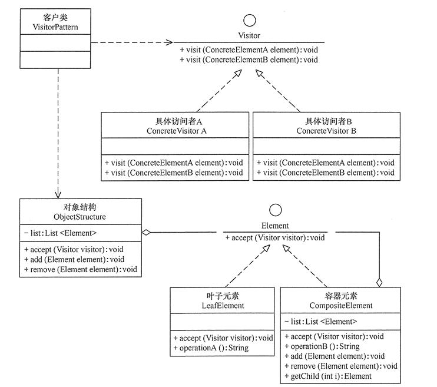
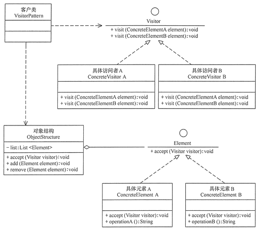

#访问者模式
##定义：
将作用于某种数据结构中的各元素的操作分离出来封装成独立的类，使其在不改变数据结构的前提下可以添加作用于这些元素的新的操作，为数据结构中的每个元素提供多种访问方式。  
它将对数据的操作与数据结构进行分离，是行为类模式中最复杂的一种模式。
##场景：
+ 1、对象结构相对稳定，但其操作算法经常变化的程序。
+ 2、对象结构中的对象需要提供多种不同且不相关的操作，而且要避免让这些操作的变化影响对象的结构。
+ 3、对象结构包含很多类型的对象，希望对这些对象实施一些依赖于其具体类型的操作。
##扩展：
+ 1、与“迭代器模式”联用。因为访问者模式中的“对象结构”是一个包含元素角色的容器，当访问者遍历容器中的所有元素时，常常要用迭代器。
+ 2、访问者（Visitor）模式同“组合模式”联用。因为访问者（Visitor）模式中的“元素对象”可能是叶子对象或者是容器对象，如果元素对象包含容器对象，就必须用到组合模式

##结构
+ 抽象访问者（Visitor）角色：定义一个访问具体元素的接口，为每个具体元素类对应一个访问操作 visit() ，该操作中的参数类型标识了被访问的具体元素。
+ 具体访问者（ConcreteVisitor）角色：实现抽象访问者角色中声明的各个访问操作，确定访问者访问一个元素时该做什么。
+ 抽象元素（Element）角色：声明一个包含接受操作 accept() 的接口，被接受的访问者对象作为 accept() 方法的参数。
+ 具体元素（ConcreteElement）角色：实现抽象元素角色提供的 accept() 操作，其方法体通常都是 visitor.visit(this) ，另外具体元素中可能还包含本身业务逻辑的相关操作。
+ 对象结构（Object Structure）角色：是一个包含元素角色的容器，提供让访问者对象遍历容器中的所有元素的方法，通常由 List、Set、Map 等聚合类实现。
