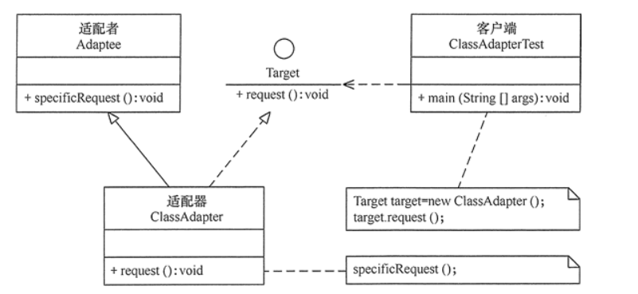
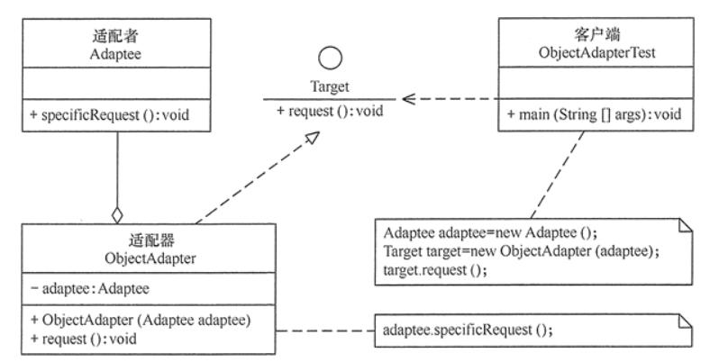
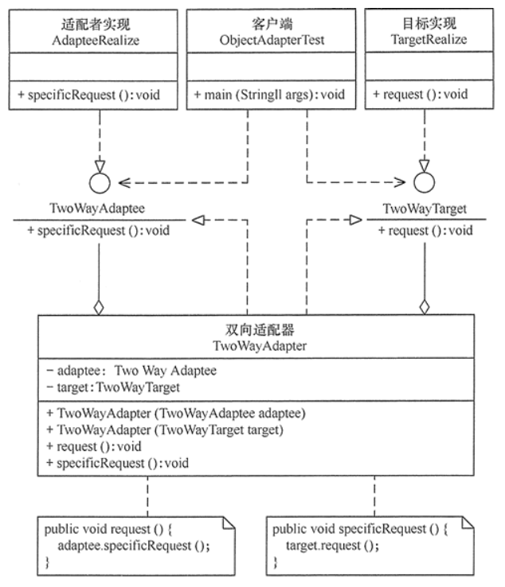

#适配器模式
##定义：
将一个类的接口转换成客户希望的另外一个接口，使得原本由于接口不兼容而不能一起工作的那些类能一起工作。  
适配器模式分为类结构型模式和对象结构型模式两种，前者类之间的耦合度比后者高，且要求程序员了解现有组件库中的相关组件的内部结构，所以应用相对较少些。
##场景：
+ 1、旧系统存在满足新系统功能需求的类，但旧系统接口与新系统的接口不一致。
+ 2、使用第三方提供的组件，但组件接口定义和自己要求的接口定义不同。
##扩展：
可扩展为双向适配器模式，双向适配器类既可以把适配者接口转换成目标接口，也可以把目标接口转换成适配者接口。
##结构
+ 目标（Target）接口：当前系统业务所期待的接口，它可以是抽象类或接口。
+ 适配者（Adaptee）类：它是被访问和适配的现存组件库中的组件接口。
+ 适配器（Adapter）类：它是一个转换器，通过继承或引用适配者的对象，把适配者接口转换成目标接口，让客户按目标接口的格式访问适配者。
######类结构适配器

######对象适配器

######双向适配器
