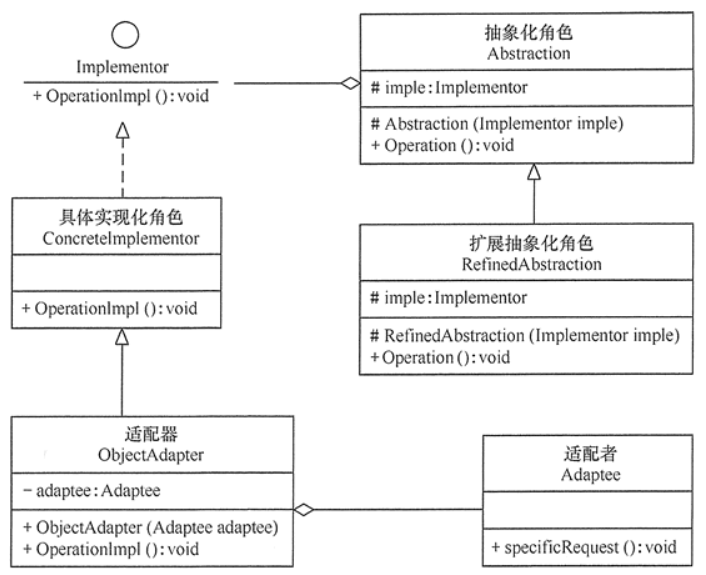
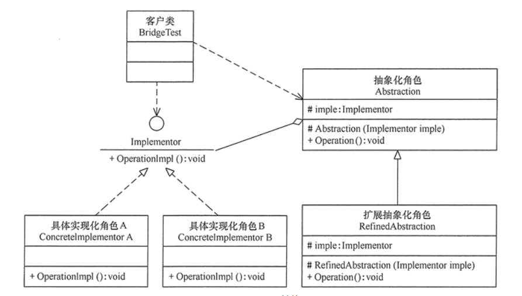

#桥接模式
##定义：
将抽象与实现分离，使它们可以独立变化。  
它是用组合关系代替继承关系来实现，从而降低了抽象和实现这两个可变维度的耦合度。
##场景：
+ 1、当一个类存在两个独立变化的维度，且这两个维度都需要进行扩展时。
+ 2、当一个系统不希望使用继承或因为多层次继承导致系统类的个数急剧增加时。
+ 3、当一个系统需要在构件的抽象化角色和具体化角色之间增加更多的灵活性时。
##扩展：
在软件开发中，有时桥接（Bridge）模式可与适配器模式联合使用。
当桥接（Bridge）模式的实现化角色的接口与现有类的接口不一致时，可以在二者中间定义一个适配器将二者连接起来。

##结构
+ 抽象化（Abstraction）角色：定义抽象类，并包含一个对实现化对象的引用。
+ 扩展抽象化（Refined    Abstraction）角色：是抽象化角色的子类，实现父类中的业务方法，并通过组合关系调用实现化角色中的业务方法。
+ 实现化（Implementor）角色：定义实现化角色的接口，供扩展抽象化角色调用。
+ 具体实现化（Concrete Implementor）角色：给出实现化角色接口的具体实现。
