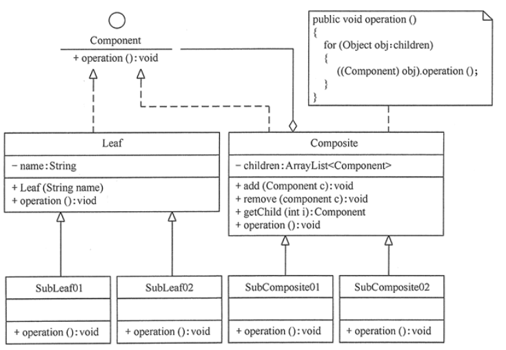
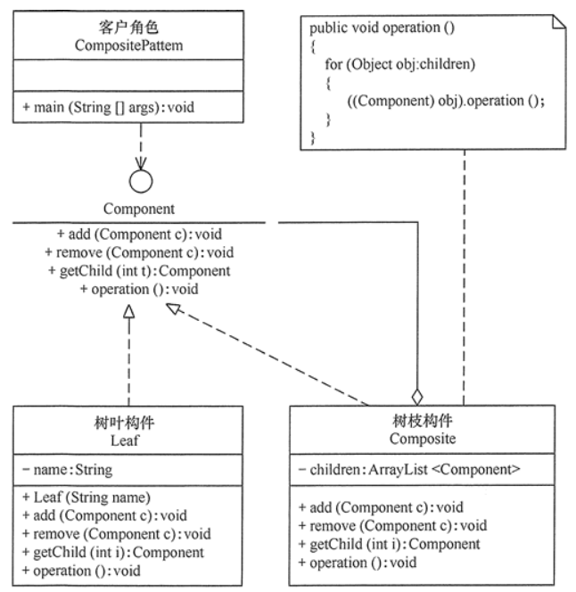
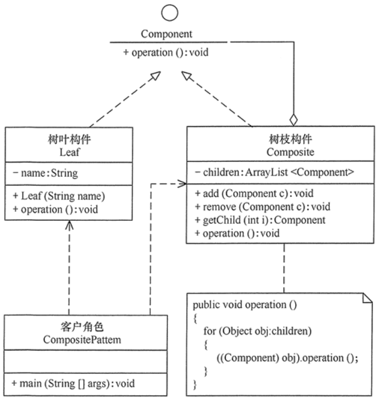

#组合模式
##定义：
有时又叫作整体-部分（Part-Whole）模式，它是一种将对象组合成树状的层次结构的模式，用来表示“整体-部分”的关系，使用户对单个对象和组合对象具有一致的访问性
##场景：
+ 1、在需要表示一个对象整体与部分的层次结构的场合。
+ 2、要求对用户隐藏组合对象与单个对象的不同，用户可以用统一的接口使用组合结构中的所有对象的场合。
##扩展：
如果对前面介绍的组合模式中的树叶节点和树枝节点进行抽象，也就是说树叶节点和树枝节点还有子节点，这时组合模式就扩展成复杂的组合模式了

##结构
+ 抽象构件（Component）角色：它的主要作用是为树叶构件和树枝构件声明公共接口，并实现它们的默认行为。在透明式的组合模式中抽象构件还声明访问和管理子类的接口；在安全式的组合模式中不声明访问和管理子类的接口，管理工作由树枝构件完成。（总的抽象类或接口，定义一些通用的方法，比如新增、删除）
+ 树叶构件（Leaf）角色：是组合中的叶节点对象，它没有子节点，用于继承或实现抽象构件。
+ 树枝构件（Composite）角色 / 中间构件：是组合中的分支节点对象，它有子节点，用于继承和实现抽象构件。它的主要作用是存储和管理子部件，通常包含 Add()、Remove()、GetChild() 等方法。

