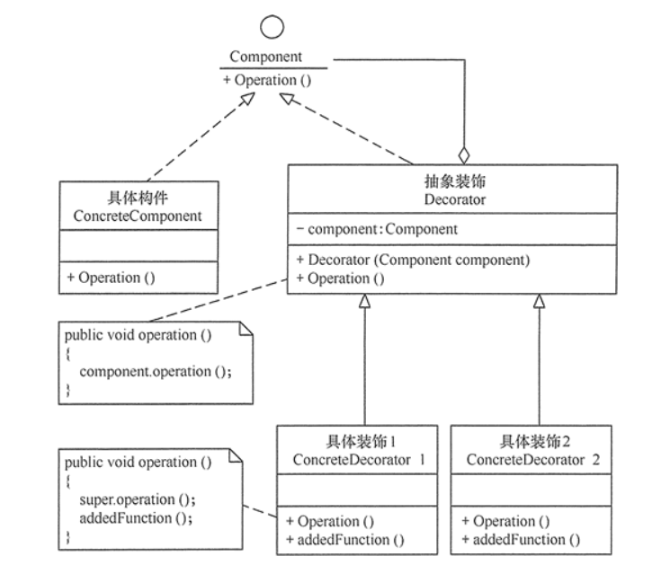

#装饰模式
##定义
指在不改变现有对象结构的情况下，动态地给该对象增加一些职责（即增加其额外功能）的模式。
##场景
+ 1、当需要给一个现有类添加附加职责，而又不能采用生成子类的方法进行扩充时。例如，该类被隐藏或者该类是终极类或者采用继承方式会产生大量的子类。
+ 2、当需要通过对现有的一组基本功能进行排列组合而产生非常多的功能时，采用继承关系很难实现，而采用装饰模式却很好实现。
+ 3、当对象的功能要求可以动态地添加，也可以再动态地撤销时。
##扩展
+ 如果只有一个具体构件而没有抽象构件时，可以让抽象装饰继承具体构件
+ 如果只有一个具体装饰时，可以将抽象装饰和具体装饰合并
##结构
+ 抽象构件（Component）角色：定义一个抽象接口以规范准备接收附加责任的对象。
+ 具体构件（Concrete    Component）角色：实现抽象构件，通过装饰角色为其添加一些职责。
+ 抽象装饰（Decorator）角色：继承抽象构件，并包含具体构件的实例，可以通过其子类扩展具体构件的功能。
+ 具体装饰（ConcreteDecorator）角色：实现抽象装饰的相关方法，并给具体构件对象添加附加的责任。
