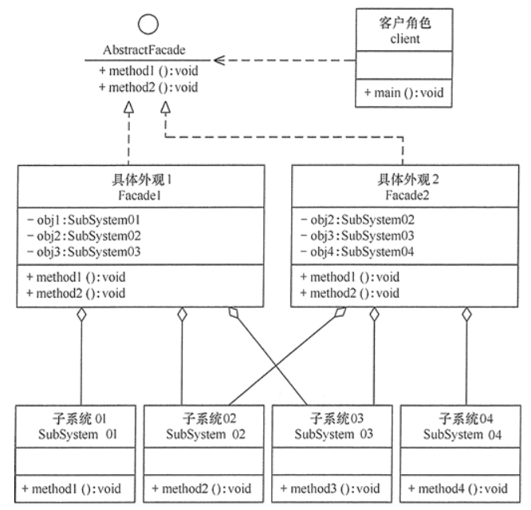
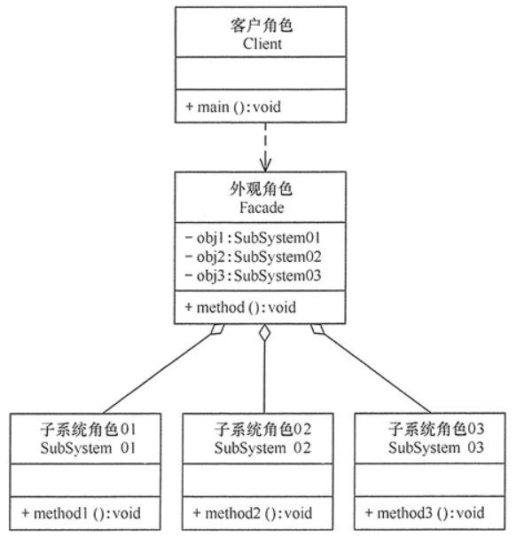

#外观模式
##定义
又叫作门面模式，是一种通过为多个复杂的子系统提供一个一致的接口，而使这些子系统更加容易被访问的模式。  
该模式对外有一个统一接口，外部应用程序不用关心内部子系统的具体细节，这样会大大降低应用程序的复杂度，提高了程序的可维护性。
##场景
+ 1、对分层结构系统构建时，使用外观模式定义子系统中每层的入口点可以简化子系统之间的依赖关系。
+ 2、当一个复杂系统的子系统很多时，外观模式可以为系统设计一个简单的接口供外界访问。
+ 3、当客户端与多个子系统之间存在很大的联系时，引入外观模式可将它们分离，从而提高子系统的独立性和可移植性。
##扩展
+ 在外观模式中，当增加或移除子系统时需要修改外观类，这违背了“开闭原则”。如果引入抽象外观类，则在一定程度上解决了该问题

##结构
+ 外观（Facade）角色：为多个子系统对外提供一个共同的接口。
+ 子系统（Sub System）角色：实现系统的部分功能，客户可以通过外观角色访问它。
+ 客户（Client）角色：通过一个外观角色访问各个子系统的功能。
