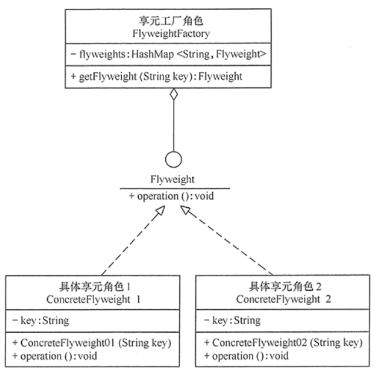
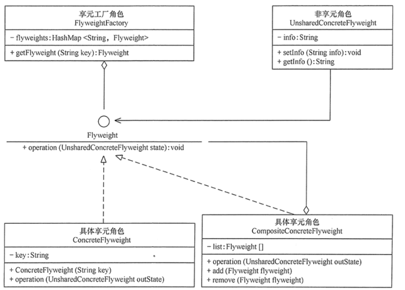
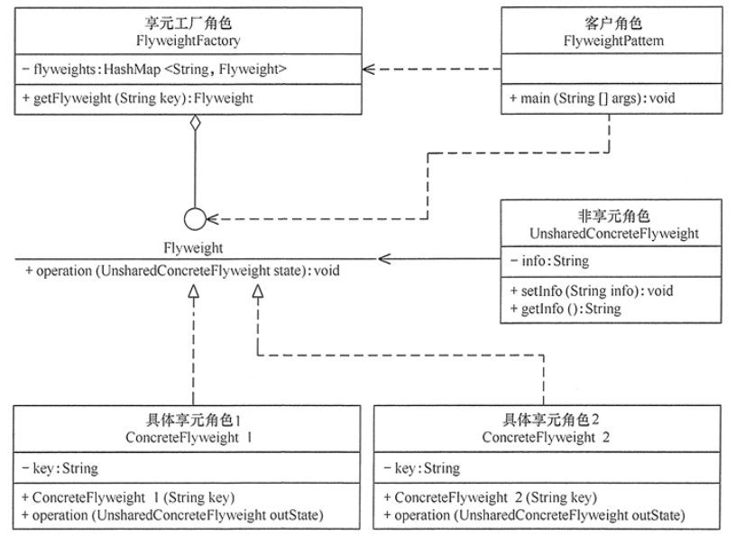

#享元模式
##定义
运用共享技术来有效地支持大量细粒度对象的复用。它通过共享已经存在的对象来大幅度减少需要创建的对象数量、避免大量相似类的开销，从而提高系统资源的利用率。
##场景
+ 1、系统中存在大量相同或相似的对象，这些对象耗费大量的内存资源。
+ 2、大部分的对象可以按照内部状态进行分组，且可将不同部分外部化，这样每一个组只需保存一个内部状态。
+ 3、由于享元模式需要额外维护一个保存享元的数据结构，所以应当在有足够多的享元实例时才值得使用享元模式。
##扩展
+ 单纯享元模式，这种享元模式中的所有的具体享元类都是可以共享的，不存在非共享的具体享元类

+ 复合享元模式，这种享元模式中的有些享元对象是由一些单纯享元对象组合而成的，它们就是复合享元对象。虽然复合享元对象本身不能共享，但它们可以分解成单纯享元对象再被共享

##结构
+ 抽象享元角色（Flyweight）：是所有的具体享元类的基类，为具体享元规范需要实现的公共接口，非享元的外部状态以参数的形式通过方法传入。
+ 具体享元（Concrete Flyweight）角色：实现抽象享元角色中所规定的接口。
+ 非享元（Unsharable Flyweight)角色：是不可以共享的外部状态，它以参数的形式注入具体享元的相关方法中。
+ 享元工厂（Flyweight Factory）角色：负责创建和管理享元角色。当客户对象请求一个享元对象时，享元工厂检査系统中是否存在符合要求的享元对象，如果存在则提供给客户；如果不存在的话，则创建一个新的享元对象。
