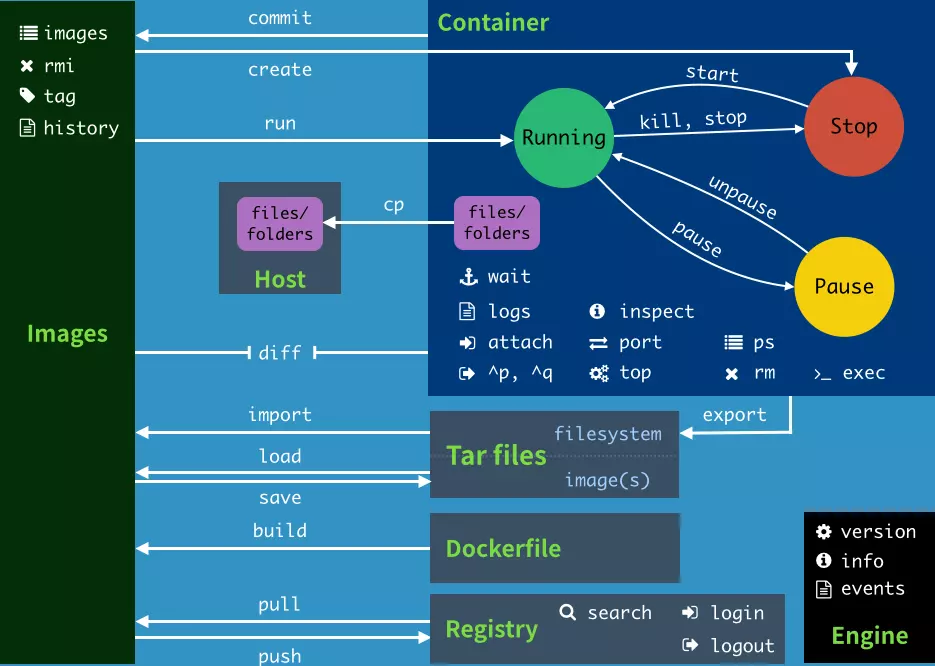

  
命令格式
```shell
docker <选项><命令><参数>
```
帮助文档
```shell
$ docker --help

用法:  docker COMMAND

A self-sufficient runtime for containers

选项:                                                                                                                           
      --config string      Location of client config files (default                                                                
                             "C:\\Users\\junchow\\.docker")                                                                          
  -D, --debug              开启debug模式
  -H, --host list          Daemon socket(s) to connect to                                                                          
  -l, --log-level string   设置日志级别，级别分为debug|info|warn|error|fatal，默认为info。                                                                             
      --tls                Use TLS; implied by --tlsverify                                                                         
      --tlscacert string   Trust certs signed only by this CA (default                                                             
                           "C:\\Users\\junchow\\.docker\\machine\\machines\\default\\ca.pem")                                      
      --tlscert string     Path to TLS certificate file (default                                                                   
                           "C:\\Users\\junchow\\.docker\\machine\\machines\\default\\cert.pem")                                    
      --tlskey string      Path to TLS key file (default                                                                           
                           "C:\\Users\\junchow\\.docker\\machine\\machines\\default\\key.pem")                                     
      --tlsverify          Use TLS and verify the remote (default true)                                                            
  -v, --version            终端打印显示版本信息并退出                                                                                                                                   
管理命令:                                                                                                               
  config      管理Docker配置
  container   管理容器                                                                                                    
  image       管理镜像
  network     管理网络
  node        管理Swarm节点
  plugin      管理插件
  secret      管理Docker安全
  service     管理服务
  swarm       管理Swarm集群
  system      管理Docker系统
  trust       Manage trust on Docker images                                                                                        
  volume      管理卷

命令:                                                                                                                          
  attach      将标准输入和标准输出连接到正在运行的容器                                        
  build       使用dockerfile文件创建镜像                                                                                     
  commit      从容器的修改项中创建新的镜像
  cp          将容器的目录或文件复制到本地文件系统中
  create      创建一个新的镜像
  diff        检查容器文件系统的修改
  events      实时输出docker服务器中发生的事件
  exec        从外部运行容器内部的命令
  export      将容器的文件系统到处为tat文件包
  history     显示镜像的历史
  images      输出镜像列表
  import      从压缩为tar文件的文件系统中创建镜像
  info        显示当前系统信息、docker容器与镜像个数、设置信息等
  inspect     使用JSON格式显示容器与镜像的详细信息
  kill        向容器发送kill信号关闭容器
  load        从tar文件或标准输入中加载镜像
  login       登录docker注册服务器
  logout      退出docker注册服务器
  logs        输出容器日志信息
  pause       暂停容器中正在运行的所有进程
  port        查看容器的端口是否处于开放状态
  ps          输出容器列表
  pull        从注册服务器中拉取一个镜像或仓库
  push        将镜像推送到docker注册服务器
  rename      重命名一个容器
  restart     重启一个或多个容器
  rm          删除一个或多个容器，若没有指定标签则删除lastest标签。
  rmi         删除一个或多个镜像，若没有指定标签则删除lastest标签。                                                
  run         在一个新容器中中运行命令，用于指定镜像创建容器。
  save        将一个或多个镜像保存为tar包             
  search      从Docker Hub中搜索镜像
  start       启动一个或多个已经停止的容器
  stats       Display a live stream of container(s) resource usage statistics                                                      
  stop        停止一个或多个正在运行的容器
  tag         设置镜像标签
  top         显示容器中正在运行的进程信息
  unpause     重启pause命令暂停的容器
  update      更新一个或多个容器的配置
  version     显示docker版本信息
  wait        等待容器终止然后输出退出码                                                                                                                                   
Run 'docker COMMAND --help' for more information on a command.
```
#容器生命周期
###docker run
```shell
# run用于指定镜像创建容器
$ docker run [选项] <镜像名称, id> [命令] [参数]


# 选项
-d, --detach=false 指定容器运行于前台还是后台，默认为false。
-i, --interactive=false 打开标准输入用于控制台交互
-t, --tty=false 分配tty设备用来支持终端登录，默认为false。
-u, --user="" 指定容器的用户
-a, --attach=[] 登录容器，必须是以docker run -d启动的容器。
-w, --workdir="" 设置容器的工作目录
-c, --cpu-shares=0 设置容器CPU权重，在CPU共享场景下使用。
-e, --env=[] 设置环境变量，容器中可使用该环境变量。
-m, --memory="" 设置容器的内存上限
-p, --public=[] 设置容器暴露的端口
-h, --hostname="" 设置容器的主机名
-v, --volume=[] 设置容器挂载的存储卷，也就是挂载到容器的某个目录。
--volumn-from=[] 给容器挂载其他容器上的卷，也就是挂载到容器的某个目录。
--cap-add=[] 添加权限
--cap-drop=[] 删除权限
--cidfile="" 运行容器后在指定文件中写入容器PID值，这是典型的监控系统的用法。
--cpuset="" 设置容器可以使用那些CPU，此参数用来设置容器独占CPU。
--device=[] 添加主机设备给容器，相当于设备直通。
--dns=[] 设置容器的DNS服务器
--dns-search=[] 设置容器的DNS搜索域名，写入到容器的/etc/resolv.conf文件。
--env-file=[] 设置环境变量文件，文件格式为每行一个环境变量。
--expose=[] 设置容器暴露的端口，即修改镜像的暴露端口。
--link=[] 设置容器之间的关联关系，使用其他容器的IP、env等信息。
--lxc-conf=[] 设置容器的配置文件，只有在指定--exe-driver=lxc时使用。
--name="" 设置容器的名称，可通过名字进行容器管理，links特性需要使用名字。
--net="bridge" 容器网络设置
--privileged=false 设置容器是否为特权容器，特权容器拥有所有的capabilities。
--restart="no" 设置让其停止后的重启策略
--rm=false 设置容器停止后自动删除容器，不支持以docker run -d启动的容器。
--sig-proxy=true 设置由代理接收并处理信号，但SIGCHLD、SIGSTOP、SIGKILL不能被代理。


# 命令
-d, --detach Detach模式，默认为守护进程模式，即容器以后台方式运行。
--rm=false 若容器内的进程终止则自动删除容器，禁止和-d选项一起使用。
--sig-proxy=true 将所有信号传递给进程，非TTY模式也一样，但不能传递SIGCHLD、SIGKILL、SIGSTOP信号。


# 运行一个在后台执行的容器，同时使用控制台管理。
$ docker run -i -t -d ubuntu:latest


# 运行一个带命令且在后台不断执行的容器，不直接展示容器内部信息。
$ docker run -d ubuntu:latest ping www.docker.com


# 运行一个在后台不断执行的容器，同时带有命令，程序被终止后还能重启继续跑，可用控制台管理。
$ docker run -d --restart=always ubuntu:latest ping www.docker.com


# 为容器指定一个名字
$ docker run -d --name=ubuntu_server ubuntu:latest


# 容器暴露80端口并指定宿主机81端口与其通信（宿主机端口:容器端口）
$ docker run -d --name=ubuntu -p 81:80 ubuntu:latest


# 指定容器内目录与宿主机目录共享（宿主机目录:容器目录）
$ docker run -d --name=ubuntu_server -v /home/www:/var/www ubuntu:latest


# 设置宿主机与docker的共享目录
$  docker run -d -i -t  -p 80:80 -v /share/swoft:/var/www/swoft --name swoft swoft/swoft /bin/bash
```
使用docker run启动容器，docker在后台的标准操作流程：  
1. 检查本地是否存在指定的镜像，若不存在则从公有仓库下载。
2. 使用镜像创建并启动容器
3. 分配一个文件系统，并在只读的镜像层外面挂载一层可读可写层。
4. 从宿主机配置的网桥接口中桥接一个虚拟机接口到容器中去
5. 从地址池分配一个IP地址给容器
6. 执行用户指定的应用程序
7. 执行完毕后容器被终止
###docker create
```shell
# create 使用指定的镜像创建容器，与run命令不同的是，使用create命令只能创建容器而并不启动。
$ docker create [选项] <镜像名称,id> <命令> [参数]


# 选项
-a, --attach=[] 将标准输入、标准输出、标准错误链接到容器
-C, --cpu-shares=0 设置CPU资源分配，默认为1024。
-e, --env=[] 向容器设备环境变量，用于传递设置或密码。
-h, --hostname="" 设置容器主机名
-i, --interactive=false 激活标准输入，即使未与容器连接，也维持标准输入。
-m, --memory="" 设置内存限制，格式<数字><单位>，单位可用b、k、m、g。
-P, --publish-all=false 将连接到主机的容器的所有端口暴露在外
-p, --publish=[] 将连接到主机的容器的特定端口暴露在外，主要用于暴露web服务器的端口。
-t, --tty=false 使用TTY模式，若要使用Bash则必须设置该选项。
-u, --user="" 设置容器运行时要使用的Linux用户账户和UID
-v, --volume=[] 设置数据卷，设置要与主机共享的目录，不将文件保存到容器而是直接保存到主机，在主机目录后添加:ro与:rw进行读写设置，默认未:rw。
-w, --workdir="" 设置容器内部要运行进程的目录
-add-host=[] 向容器的/etc/hosts添加主机名与IP地址
--cap-add=[] 设置容器中使用的cgroups的特定capablity，若设置为all则使用所有的capablity。
--cap-drop=[] 从容器中删除cgroup的特定capablity。
--cidfile="" 设置cid文件路径，cid中存储着所创建容器的id。
--cpuset="" 在多核CPU中设置要运行容器的核心数
--device=[] 添加主机设备到容器，格式为<主机设备>:<容器设备>
--dns=[] 设置容器中使用的DNS服务器
--dns-search=[] 设置docker中要使用的DNS搜索域
--entrypoint="" 忽略Dockerfile的ENTRYPOINT设置，强制设置为其他值。
--env-file=[] 向容器应用设置环境变量文件
--expose=[] 仅连接容器的端口和主机，并不暴露在外。
--link=[] 进行容器连接，格式 <容器名称>:<别名>
--lxc-conf=[] 若使用LXC驱动则可设置LXC选项
--name 设置容器名称
--net="bridge" 设置容器的网络模式
--privileged=false 在容器内部使用主机的所有linux内核功能
--restart="" 设置容器内部进程终止时重启策略
--security-opt=[] 设置SELinux、AppArmor选项
--volumn-from=[] 连接数据卷容器，设置格式未<容器名称,id>:<:ro, :rw>，默认读写设置遵从-v选项的设置。


# 使用docker镜像nginx:latest创建一个容器名为ubuntu_serve
$ docker create --name ubuntu_serve ubuntu:latest
$ docker create -it --name ubuntu_server ubutnu:latest /bin/bash
```
###docker start
```shell
# start用于启动容器
$ docker start <选项><容器名称, id>


# 选项
-a, --attach=false 将标准输入、标准输出、标准错误连接到容器，传递所有信号。
-i, --interactive=false 激活标准输入
```
###docker stop
```shell
# stop用于终止容器
$ docker stop <选项><容器名称, id>


# 选项
-t, --timeout=10 设置终止容器前的等待时间，单位为秒。
```
###docker restart
```shell
# restart 用于重启容器
$ docker restart [选项] <容器名称, id>
```
###docker pause
```shell
# pause 用于暂停容器中所有的进程
$ docker pause [选项] <容器名称, id>
```
###docker unpause
```shell
# unpause用于重启使用pause命令暂停的容器
$ docker unpause <容器名称, id>
```
###docker kill
```shell
# kill用于杀掉一个运行中的容器，发送SIGKILL信号来停止的主进程。
$ docker kill [选项] <容器名称, id>


# 选项
-s 向容器发送一个信号


# 杀死运行中的容器nginx
$ docker kill -s KILL nginx
```
###docker rm
```shell
# rm用于删除一个或多个容器
$ docker rm [选项] <容器名称,id>


# 选项
-f 通过SIGKILL信号强制删除一个运行中的容器
-l 移除容器间的网路连接而非容器本身
-v 删除与容器关联的卷


# 强制删除容器test
$ docker rm -f test


# 删除容器test并删除挂载的数据卷
$ docke rm -v test
```
###docker exec
```shell
# exec 用于在运行中的容器中执行命令
$ docker exec [选项] <容器名称, id> <命令> [参数]


# 选项
-d 分离模式即在后台运行
-i 即使没有附加也保持STDIN标准输入打开
-t 分配一个伪终端


# 在容器test中以交互模式执行容器内/root/test.sh脚本
$ docker exec -it test /bin/sh /root/test.sh
```
#容器操作
###docker ps
```shell
# ps用于输出容器列表
$ docker ps <选项>


# 选项
-a, --all=false 列出所有容器，不带-a则输出当前正在运行的容器。
--before="" 列出特定容器创建前的容器，包含停止的容器。
-f, --filter=[] 设置输出过滤
-l, --latest=false 列出最后创建的容器包含停止的容器
-q, --quiet=false 只输出容器的ID


$ docker ps
CONTAINER ID        IMAGE               COMMAND             CREATED             STATUS              PORTS               NAMES
```
###docker top
```shell
# top用户显示容器中正在 运行的进程信息
$ docker top <容器名称, id><ps选项>


$ docker top
```
###docker attach
```shell
# attach 用于将标准输入与标准输出连接到正在运行的容器
$ docker attach <选项><容器名称, id>
```
###docker logs
```shell
# logs用于获取容器的日志
$ docker logs [选项] <容器名称,id>


# 选项
-f 跟踪日志输出
--since 显示某个开始时间的所有日志
-t 显示时间戳
--tail 仅仅列出最新n条容器日志


# 跟踪查看test容器的日志
$ docker logs -f test


# 查看test容器从2019年4月1日以后的最新10条日志
$ docker logs --since="2019-04-01" --tail=10 test
```
如何动态跟踪并查看myswoft容器的日志详情呢？  
> docker@ ~$: docker logs -tf --details myswoft

如何清理日志文件呢？  
Docker日志默认存储位于：/var/lib/docker/containers/<container_id>/*.log 
```shell
# 在docker中切换为root用户
docker@default: ~$ su -i


# 查看docker容器的id
root@default: ~$ docker ps -a | grep myswoft
d26ff0ff1bc0        swoft/swoft         "php /var/www/swoft/…"   2 weeks ago         Up 22 minutes       0.0.0.0:80->80/tcp                  myswoft


# 查看容器日志文件大小
root@default: ~$ ls -lh  $(find /var/lib/docker/containers/ -name *-json.log)
-rw-r-----    1 root     root           0 May 14 13:32 /var/lib/docker/containers/d26ff0ff1bc0dc0221ce5be7f78da96123a0ddbb379ab8befd2d1403f44e820b/d26ff0ff1bc0dc0221ce5be7f78da96123a0ddbb379ab8befd2d1403f44e820b-json.log


# 进入日志目录
root@default: ~$ cd /var/lib/docker/containers/d26ff0ff1bc0dc0221ce5be7f78da96123a0ddbb379ab8befd2d1403f44e820b


# 临时清理日志文件
root@default: /var.../$ truncate -s 0 /var/lib/docker/containers/<container_id>/*-json.log


# 临时清理日志文件
root@default: /var../$ cat /dev/null > *-json.log


# 使用rm删除日志文件后是需要重启容器的，如果容器运行状态下Linux进程会引用着不会释放磁盘空间。
root@default /var/.../$ rm -rf *-json.log
```
###docker port
```shell
# port用于列出指定容器的端口映射，或者用于查找将PRIVATE_PORT NAT到面向公众的端口。
$ docker port [选项] <容器名称,id> [PRIVATE_PORT[/PROTO]]


# 查看test容器的端口映射情况
$ docker port test
```
#镜像仓库
###docker search
```shell
# search用于在docker hub中搜索镜像
$ docker search <选项><搜索关键词>


# 选项
--automated=false 只显示由docker hub的automated build创建的镜像
--no-trunc=false 显示所有因内容过长而省略的部分
-s, --stars=0 显示有特定星级以上的镜像
```
#本地镜像
###docker images
```shell
# images用于输出镜像列表
$ docker images <选项><镜像名称, id>


# 选项
-a, --all=false 列出所有镜像包含父镜像。
-f, --filter=[] 设置输出结果过滤，若设置为dangling=true则仅输出无名镜像。
--no-trunc=false 显示所有因内容过长而省略的部分


$ docker images
REPOSITORY          TAG                 IMAGE ID            CREATED             SIZE
```
###docker rmi
```shell
# rmi 用于删除镜像，若没有指定标签则会删除latest标签。
$ docker rmi <注册名称>/<镜像名称, id>:<标签>


# 选项
-f, --force=false 强制删除镜像
--no-prune=false 不删除不带标签的父级镜像


# 删除所有镜像
$ docker rmi `docker images -aq`
```
###docker tag
```shell
# tag用于设置镜像标签
$ docker tag <选项><镜像名称>:<标签><注册地址, 用户名>/<镜像名称>:<标签>


# 选项
- f, --force=false 强制设置，即使已拥有标签，如远程仓库设置标签。
```
###docker save
```shell
# save用于将镜像保存为tag包文件
$ docker save <选项><镜像名称>:<标签>


# 选项
-o, --output="" 设置保存时的文件名称

若不设置-o选项，tar包文件会输出到标准输出，所以必须设置重定向。如果仅指定镜像名称但没有指指定标签，则会将所有标签都保存到一个tar包文件中。
```
#信息查看
###docker info
```shell
# info用于显示当前系统信息、docker容器和镜像数量、设置等信息。
$ docker info
Containers: 0
Running: 0
Paused: 0
Stopped: 0
Images: 0
Server Version: 18.09.5
Storage Driver: overlay2
Backing Filesystem: extfs
Supports d_type: true
Native Overlay Diff: true
Logging Driver: json-file
Cgroup Driver: cgroupfs
Plugins:
Volume: local
Network: bridge host macvlan null overlay
Log: awslogs fluentd gcplogs gelf journald json-file local logentries splunk syslog
Swarm: inactive
Runtimes: runc
Default Runtime: runc
Init Binary: docker-init
containerd version: bb71b10fd8f58240ca47fbb579b9d1028eea7c84
runc version: 2b18fe1d885ee5083ef9f0838fee39b62d653e30
init version: fec3683
Security Options:
seccomp
Profile: default
Kernel Version: 4.14.111-boot2docker
Operating System: Boot2Docker 18.09.5 (TCL 8.2.1)
OSType: linux
Architecture: x86_64
CPUs: 1
Total Memory: 989.4MiB
Name: default
ID: 7ST2:CIQM:GLVF:AUF2:QFKR:N2LB:FSO7:V6UJ:5IFN:MQVZ:WK7L:TGSS
Docker Root Dir: /mnt/sda1/var/lib/docker
Debug Mode (client): false
Debug Mode (server): false
Registry: https://index.docker.io/v1/
Labels:
provider=virtualbox
Experimental: false
Insecure Registries:
127.0.0.0/8
Live Restore Enabled: false
```
###docker version
```shell
# version用户输出docker的版本信息
$ docker version
Client:
Version:       18.03.0-ce
API version:   1.37
Go version:    go1.9.4
Git commit:    0520e24302
Built: Fri Mar 23 08:31:36 2018
OS/Arch:       windows/amd64
Experimental:  false
Orchestrator:  swarm


Server: Docker Engine - Community
Engine:
Version:      18.09.5
API version:  1.39 (minimum version 1.12)
Go version:   go1.10.8
Git commit:   e8ff056dbc
Built:        Thu Apr 11 04:50:00 2019
OS/Arch:      linux/amd64
Experimental: false
```