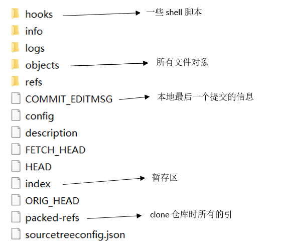

#1、概念
Git是分布式版本控制系统，它就没有中央服务器的，每个人的电脑就是一个完整的版本库
#2、工作区原理
* Workspace: 工作区，就是你平时存放项目代码的地方
* Index / Stage: 暂存区，用于临时存放你的改动，事实上它只是一个文件，保存即将提交到文件列表信息
* Repository: 仓库区（或本地仓库），就是安全存放数据的位置，这里面有你提交到所有版本的数据。其中HEAD指向最新放入仓库的版本
* Remote: 远程仓库，托管代码的服务器，可以简单的认为是你项目组中的一台电脑用于远程数据交换


这个图很清晰了，再来看一下.git文件，这个是隐藏文件
  
这是本人的一些了解，有想深入研究细节的，推荐几个博客自己看  
[博客](https://blog.csdn.net/songyuequan/article/details/82933745)  
[博客](https://blog.csdn.net/songyuequan/article/details/85862415)  
#3、常用Git命令
```
git init : 在当前路径生成本地git管理，即 Repository(本地仓库)  
git remote add origin url: 将本地仓库与指定的远程仓库创建 联系  
git clone : 从 Remote(远程仓库，如公司gitlib私服、github)拉取  
git status : 查看当前 git 的状态，可以知道目前在哪个分支上、是否有改动等  
git diff : 尚未缓存的改动: git diff  
  git diff --cached : 查看已缓存的改动
  git diff HEAD : 查看已缓存的与未缓存的所有改动 
  git diff --stat : 显示摘要而非整个

git add : git add file     ->将指点文件保存至缓存区  
git add .         ->提交新文件(new)和被修改(modified)文件，不包括被删除(deleted)文件  
git add -A      ->提交所有变化  
gti add -u      ->提交被修改(modified)和被删除(deleted)文件，不包括新文件(new)  
git reset HEAD : 用于取消已缓存的内容  
git commit -m "message": 将代码从缓存区保存至本地仓库；-m 添加提交信息  
git push : 将代码从本地仓库推送至远程仓库  
git fetch : 下载远程仓库最新代码，此时还未合并到本地分支  
git merge : 将拉取的代码合并本地分支  
git pull : = git fetch + git merge  
git branch : git branch //查看本地所有分支  
git branch -r //查看远程所有分支  
git branch -a //查看本地和远程的所有分支  
git branch <branchname> //新建分支  
git branch -d <branchname> //删除本地分支  
git branch -d -r <branchname> //删除远程分支，删除后还需推送到服务器  
git push origin:<branchname>  //删除后推送至服务器  
git branch -m <oldbranch> <newbranch> //重命名本地分支
```
#4、关于marge和rebase
git rebase : 会把你当前分支的 commit 放到公共分支的最后面  
git merge : 会把公共分支和你当前的commit 合并在一起，形成一个新的 commit 提交，若有冲突，手动解决  
[参考](https://www.jianshu.com/p/4079284dd970  )
