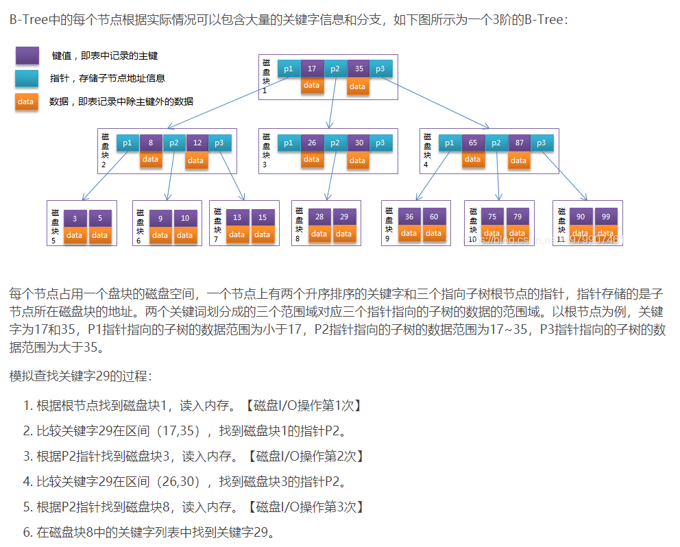

# mysql
## 数据库引擎 show engines;
| |innodb|myisam|
|:----:|:----:|:----:|
|存储限制| 64TB | 256TB |
|支持事务| Y | N |
|支持全文索引| Y | Y |
|支持 B-tree 索引| Y | Y |
|支持 聚集 索引| Y | N |
|支持 hash 索引| N | N |
|支持数据缓存| Y | N |
|支持外键| Y | N |
|锁粒度| 行锁、表锁 | 表锁 |
* MySQL 5.6 和更高版本提供了对 FULLTEXT 索引的 InnoDB 支持。
* InnoDB 5.7后内置***ngram***(中文检索分词插件)全文索引查询，先得在MySQL配置文件里面设置他的分词大小（默认是2），分词的SIZE越小，索引的体积就越大
> 全文索引 ddl  
>> alter table T add fulltext index test_fulltext(clumn1,clumn2) with parser ngram;
* InnoDB 在内部将哈希索引用于其自适应哈希索引功能。（即 innodb 的hash索引是自适应的，根据表的使用情况自动生成）
> 查看 hash 索引是否启用
>> show variables like '%hash_index';
## 索引
### 数据结构
mysql 基础存储结构为页，innodb 一页默认大小为16K
> 查看页大小
>> show variables like 'innodb_page_size'; 
* B-Tree  

* 一个节点即一页，节点key数量和data大小乘反比 (Node(16K) = key * data)
* B+Tree
* 1、非叶子节点只存储键值信息
* 2、所有叶子节点之间都有一个链指针
* 3、数据记录都存放在叶子节点中
* 4、聚集索引：叶子节点存放整张表的完整行数据
* 5、非聚集索引：叶子节点存放相应行数据的聚集索引键（指向data的指针），再根据聚集索引键找到完整的行数据（回表）
* 6、每张表最多只有一个聚集索引，一般为主键，（若无主键，innodb 会隐式创建一个 id）
### 如何存放
#### myisam
* .frm: 表定义文件
* .MYD: 数据
* .MYI: 索引
主键索引和辅助索引是通过在叶子节点存放数据的引用地址
#### innodb
* .frm: 表定义文件
* .idb: 数据和索引
辅助索引中存放的是主键索引，流程是根据辅助索引查询到主键索引，在主键索引中查询到对应的数据
### 有哪些索引
* 1、主键索引
* 2、唯一索引
* 3、组合索引（一个索引最大可以包含16 个列）
* 4、普通索引
* 5、全文索引
### 索引选取规则
* 1、寻找可能的（可选）索引：根据用户的WHERE条件，查看每个字段是否匹配某个索引，如果匹配，就把这个索引加入待选列表中。所谓字段匹配索引有3种情况:  
1）某个查询字段上建立了单列索引  
2）某个查询字段按照最左匹配原则（下文有详细描述）匹配了某个组合索引,即为该组合索引的第一列  
3）某几个查询字段按照最左匹配原则匹配了某个组合索引。可选索引列表可使用EXPLAIN查看（possible keys）。待选列表如果为空，GOTO 3
* 2、索引择优算法：Mysql的索引择优算法很复杂，一般来说有这几个影响因素：  
1）索引对应的扫描行数，在没有Order by的情况下，一般扫描行数少的索引会被选择  
2）查询语句中有Order By或者group by时，如果不使用Order By后的字段做索引的话，filesort（对应索引排序，索引排序很快，而filesort则需要对结果集进行实时排序，所以很慢）会被使用，
这时候Mysql给filesort的负权重很高，很容易导致Mysql放弃最优索引（哪怕该索引估计扫描行数比实际使用的索引对应的扫描行数小很多），转而使用Order By之后的索引字段。  
3）Limit 限定也会影响索引的使用，甚至Limit后的值也会影响索引的使用（有时候确实会令人费解）  
4）话不能说满，官网文档写的实在含糊，所以这里不敢打包票没有其他影响因素了。如果优选的扫描索引不为空，GOTO 4。
* 3、如果没找到可用索引的话，再考察查询字段，也就是Select之后Where之前的那些字段。
寻找查询字段所匹配的索引，并得到一个可用索引结果集。
根据最小估算扫描行数优先原则，可以得到最优的索引。
如果可用索引结果集仍然为空，那么就会使用全表扫描(Full table scan)。
* 4、如果根据最终选择的索引估算出的扫描行数占据了表的很大一部分比例，那么Mysql优化器可能会放弃使用该索引，而退化为使用全表扫描。
这是因为使用索引在有些情况下并不高效，比如索引出来的数据量很大，需要频繁的改变文件读取指针去获取数据块，可能效果还不如从头到位把整个表都扫描一边，也省去了去查找索引和频繁重定向读取指针（尤其在磁盘存储器[4]上）带来的开销。
* 5、如果到这步Mysql搜索优化器仍然决定用某个索引，那么就会在实际查询时使用该索引了。这个索引也是EXPLAIN分析语句结果集中key的值
### 何时会全表扫描
* 1、目标数据表太小了，再去查找索引（key lookup）太麻烦了（有点杀鸡焉用牛刀的即视感）。
这通常发生在10行都不到的数据表，并且每行很短的情况。（注： 10这个数字不可靠，这里只是感性的说了个数字，可能小几十行的数据仍然会触发全表扫描）
* 2、查询条件中的字段（WHERE后）没有匹配到索引的情况。（也不是说匹配不到就一定会全表扫描，见下文默认索引选择算法）
* 3、查询条件中的字段与某个常量比较时（就比如where age > 8)，并且使用这个常量值与对应索引筛选出的记录数占了总数的大部分。优化器认为扫这么大的数据还不如扫全表了，所以选择了扫描全表。大部分怎么定义恐怕只有Mysql开发者才知道，官网也并没有给出具体数值。
* 4、查询语句匹配到的索引对应的基数太小（对应SHOW INDEX FROM table_name结果中的Cardinality )，并且此时又有其他列上的查询条件（比如:select * from user where user_status > 0 and username =’tommy’）。
所谓基数就是表中某列所有值的取值种数，比如一张表有5行，某一列对应的值分别为：1,2,3,3,2。那么该列基数就是3，因为一共有三种取值：1,2,3。 基数小，意味着该索引中每个索引值对应的目标记录数很大，在这个索引值对应的记录数中再去一个个的检查其他列上的条件是否满足，整个过程总体的查找速度还未必有全表扫描来得快。
* 5、经测试，第3点当且仅当比较符号为非等于时才生效。如果使用了等于号，那么只要该列有匹配的索引，一定会命中，哪怕基数为1。所以当查询条件中有基数小的列时，某个索引值的条件只是从等于号改成小于号，就可能从使用索引退化到扫描全表。查看某个SQL语句是否使用某个索引靠谱的做法只有一个——使用Explain语句分析SQL。
### 默认索引选择算法
* 1、当查询语句的搜索条件没有命中任何索引时，Mysql索引优化器会考量查询语句中的目标字段（select后面，where前面的部分），目标字段除去主键外，如果恰好是某个索引（包括组合索引）对应列的子集，那么该索引也会被使用。如果满足的索引有多个，将会使用索引记录数最少的索引。
### 聚簇索引和非聚簇索引
#### 聚簇索引
* 定义: 数据行的物理顺序与列值（一般是主键的那一列）的逻辑顺序相同，一个表中只能拥有一个聚集索引
* 1、聚簇索引叶子节点存储整行数据和表数据key，对于innodb:   
1）如果显式定义了主键，则主键作为聚簇索引   
2）如果没有显式定义主键，则该表的第一个非空唯一索引作为聚簇索引  
3）如果没有显式定义主键也没有合适的唯一索引，那么innodb内部会生成一个隐藏的主键作为聚集索引，这个隐藏的主键是一个6个字节的列，改列的值会随着数据的插入自增  
#### 非聚簇索引
* 定义: 该索引中索引的逻辑顺序与磁盘上行的物理存储顺序不同，一个表中可以拥有多个非聚集索引
### 组合索引
#### 最左前缀匹配原则
对列col1、列col2和列col3建一个联合索引：  

`KEY test_col1_col2_col3 on test(col1,col2,col3);`  

联合索引 test_col1_col2_col3 实际建立了(col1)、(col1,col2)、(col,col2,col3)三个索引。  
* 多列索引是先按照第一列进行排序，然后在第一列排好序的基础上再对第二列排序，如果没有第一列的话，直接访问第二列，那第二列肯定是无序的，直接访问后面的列就用不到索引了。  

`select * from mytable where a=3 and b>7 and c=3;(范围值就算是断点)`

a用到了，b也用到了，c没有用到，这个地方b是范围值，也算断点，只不过自身用到了索引

`select * from mytable where a=3 order by b;`

a用到了索引，b在结果排序中也用到了索引的效果，前面说了，a下面任意一段的b是排好序的

`select * from mytable where a=3 order by c;`

a用到了索引，但是这个地方c没有发挥排序效果，因为中间断点了，使用 explain 可以看到 filesort

`select * from mytable where b=3 order by a;`

b没有用到索引，排序中a也没有发挥索引效果

https://www.cnblogs.com/hongmoshui/p/10429842.html

在对查询条件（where后的）中的字段进行组合索引的匹配时，只考虑匹配其前N个字段，比如前一个（第一个）、前2个、前3个字段等。其他情况视为未匹配。
### 索引覆盖
## 锁
## 事务
## sql优化
推荐文章-> https://www.cnblogs.com/-mrl/p/13282459.html
## sql执行过程
## other
| |单表最大字段数|单表最大索引数|单索引最多包含索引数|
|:----:|:----:|:----:|:----:|
|innodb| 1017列 | 64个二级索引 | 16列 |
|myisam| 4096列 | 64个二级索引 | 16列 |

强制走索引 dql  
`select column1, column2 from table1 force index(index_name1)`  
忽略索引 dql  
`select column1, column2 from table1 ignore index(index_name1, index_name2)`  
计算索引的合适长度
`select count(distinct left(column, 5)) / count(*) from table;`
## 数据查询语言DQL, 数据操纵语言DML, 数据定义语言DDL, 数据控制语言DCL  
https://www.cnblogs.com/fan-yuan/p/7879353.html  

next-key加锁规则里面，包含了两个“原则”、两个“优化”和一个“bug”  
原则 1：加锁的基本单位是 next-key lock。next-key lock 是前开后闭区间,如（5，10]。  
原则 2：查找过程中访问到的对象才会加锁。  
优化 1：索引上的等值查询，给唯一索引加锁的时候，next-key lock 退化为行锁。  
优化 2：索引上的等值查询，向右遍历时且最后一个值不满足等值条件的时候，next-key lock 退化为间隙锁。  
一个 bug：唯一索引上的范围查询会访问到不满足条件的第一个值为止。  
在正序查询时，如果查询条件满足优化1，依旧会退化成行锁；但在倒序查询时，不会采用优化1；  
在范围查询时，如果有不涉及的行，那么最后一个next-key会退化成间隙锁（这是一个比较好的优化，不会锁住表中已经存在的行，提高了并发度）  
在正序查询时，bug已经修复，如果发现唯一索引满足等值条件，不会再往下找；倒序查询时，bug依旧存在，在唯一索引满足等值条件时，依旧会往前或往后搜索。  
InnoDb 在插入记录时，是不加锁的。如果事务 A 插入记录且未提交，这时事务 B 尝试对这条记录加锁，事务 B 会先去判断记录上保存的事务 id 是否活跃，如果活跃的话，那么就帮助事务 A 去建立一个锁对象，然后自身进入等待事务 A 状态，这就是所谓的隐式锁转换为显式锁。  

rc 隔离级别没有gap锁 同时也不存在锁升级（锁定的行数在总行数里的比例 > 0.175, record lock 升级 table lock ）  