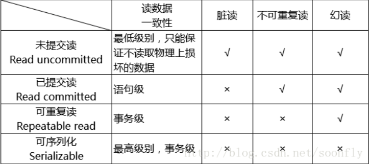

#前言
在Mysql中只有innodb是支持事务的，而且完全符合ACID  
>A：atomicity        原子性  
B：consistency       一致性  
C：isolation         隔离性  
D：durability        持久性  

>事务原理：通过 ”事务日志“

事务日志细分为 redo log 和 undo log  
>redo log ：物理日志，记录数据库对页的操作，由2部分组成：redo log buffer 和 redo log file  
redo log buffer(重做日志缓冲)：存在内存，易失  
redo log file(重做日志文件)：存在磁盘，持久  
*redo log存在于  redo log file 中  
【事务涉及的所有SQL语句】->【redo log buffer】->【os buffer】->【redo log file】->【数据库】  
可以通过在配置问价(my.in)中修改 innodb_flush_log_at_trx_commit 来调整 redo log buffer 写入 redo log file 的策略

>undo log ：逻辑日志，对应逻辑上的增删改查，可以理解为事务开始前的数据备份  
*undo log存在于 undo段(undo segment)，undo段存在于共享表空间  
log group ：重做日志组，应该重做日志组有多个redo log file(重做日志文件)，第一个被写满，写下一个；全部写满，则重新写入第一个，覆盖原来的  
*通过 innodb_log_files_in_group 指定一个日志组有多少日志文件  
题外话：不管是 redo log 还是 undo log 都是innodb 的产物，除此之外还有一种重要的日志-> binlog  
binlog：二进制日志，是在 mysql 主从复制中的用到的日志；记录的是逻辑日志，也就是对应的SQL  
针对的是整个 mysql 数据库，数据库任何引擎对数据库的操作否会产生 binlog  
binlog 只在事务提交完成后进行一次磁盘写入
#事务隔离级别
###数据库实现事务隔离的方式
1. 在读取数据前，对其加锁，阻止其他事务对数据进行修改。
2. 不用加任何锁，通过一定机制生成一个数据请求时间点的一致性数据快照（Snapshot），并用这个快照来提供一定级别（语句级或事务级）的一致性读取。
从用户的角度，好像是数据库可以提供同一数据的多个版本，因此，这种技术叫做数据多版本并发控制（ＭultiVersion Concurrency Control，简称MVCC或MCC），也经常称为多版本数据库。  

在MVCC并发控制中，读操作可以分成两类：快照读 (snapshot read)与当前读 (current read)。  
快照读，读取的是记录的可见版本 (有可能是历史版本)，不用加锁。  
当前读，读取的是记录的最新版本，并且，当前读返回的记录，都会加上锁，保证其他事务不会再并发修改这条记录。  

#InnoDB的行锁模式及加锁方法
InnoDB实现了以下两种类型的行锁。  
共享锁（s）：又称读锁。允许一个事务去读一行，阻止其他事务获得相同数据集的排他锁。若事务T对数据对象A加上S锁，则事务T可以读A但不能修改A，其他事务只能再对A加S锁，而不能加X锁，直到T释放A上的S锁。这保证了其他事务可以读A，但在T释放A上的S锁之前不能对A做任何修改。  

排他锁（Ｘ）：又称写锁。允许获取排他锁的事务更新数据，阻止其他事务取得相同的数据集共享读锁和排他写锁。若事务T对数据对象A加上X锁，事务T可以读A也可以修改A，其他事务不能再对A加任何锁，直到T释放A上的锁。  

对于共享锁大家可能很好理解，就是多个事务只能读数据不能改数据。  
对于排他锁大家的理解可能就有些差别，我当初就犯了一个错误，以为排他锁锁住一行数据后，其他事务就不能读取和修改该行数据，
其实不是这样的。排他锁指的是一个事务在一行数据加上排他锁后，其他事务不能再在其上加其他的锁。
mysql InnoDB引擎默认的修改数据语句：update,delete,insert都会自动给涉及到的数据加上排他锁，select语句默认不会加任何锁类型，
如果加排他锁可以使用select …for update语句，加共享锁可以使用select … lock in share mode语句。
所以加过排他锁的数据行在其他事务种是不能修改数据的，也不能通过for update和lock in share mode锁的方式查询数据，
但可以直接通过select …from…查询数据，因为普通查询没有任何锁机制。  

另外，为了允许行锁和表锁共存，实现多粒度锁机制，InnoDB还有两种内部使用的意向锁（Intention Locks），这两种意向锁都是表锁。  
意向共享锁（IS）：事务打算给数据行共享锁，事务在给一个数据行加共享锁前必须先取得该表的IS锁。  
意向排他锁（IX）：事务打算给数据行加排他锁，事务在给一个数据行加排他锁前必须先取得该表的IX锁。  
事务可以通过以下语句显式给记录集加共享锁或排他锁：  
共享锁（S）：SELECT * FROM table_name WHERE ... LOCK IN SHARE MODE。  
排他锁（X）：SELECT * FROM table_name WHERE ... FOR UPDATE。  
用SELECT ... IN SHARE MODE获得共享锁，主要用在需要数据依存关系时来确认某行记录是否存在，并确保没有人对这个记录进行UPDATE或者DELETE操作。但是如果当前事务也需要对该记录进行更新操作，则很有可能造成死锁，对于锁定行记录后需要进行更新操作的应用，应该使用SELECT… FOR UPDATE方式获得排他锁。  

InnoDB行锁是通过给索引上的索引项加锁来实现的，这一点MySQL与Oracle不同，后者是通过在数据块中对相应数据行加锁来实现的。InnoDB这种行锁实现特点意味着：只有通过索引条件检索数据，InnoDB才使用行级锁，否则，InnoDB将使用表锁！  

① Serializable（串行化）：花费最高代价但最可靠的事务隔离级别。
“写”会加“写锁”，“读”会加“读锁”。当出现读写锁冲突的时候，后访问的事务必须等前一个事务执行完成，才能继续执行。
事务 100% 隔离，可避免脏读、不可重复读、幻读的发生。  
② Repeatable read（可重复读，默认级别）：多次读取同一范围的数据会返回第一次查询的快照，即使其他事务对该数据做了更新修改。事务在执行期间看到的数据前后必须是一致的。
但如果这个事务在读取某个范围内的记录时，其他事务又在该范围内插入了新的记录，当之前的事务再次读取该范围的记录时，会产生幻行，这就是幻读。
可避免脏读、不可重复读的发生。但是可能会出现幻读。  
③ Read committed (读已提交)：保证一个事物提交后才能被另外一个事务读取。另外一个事务不能读取该事物未提交的数据。
可避免脏读的发生，但是可能会造成不可重复读。
大多数数据库的默认级别就是 Read committed，比如 Sql Server , Oracle。  
④ Read uncommitted (读未提交)：最低的事务隔离级别，一个事务还没提交时，它做的变更就能被别的事务看到。
任何情况都无法保证。
